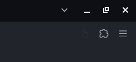
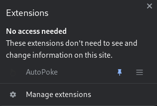
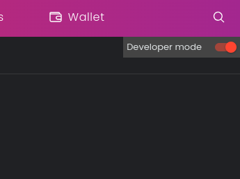
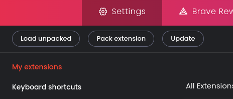

# AutoPoke
This is a simple web extension for Facebook's poke.

Recently, Facebook's poke feature is popular. You can poke your friends and poke them back. 

Whether you want to farm for pokes, or just want to annoy your friends, you can use this web extension to automate the poking for you.

## How to install?
1. Use git clone to download the contents of this repo, or if you're not comfortable with that, download the repo as zip.
    ```
    git clone https://github.com/veenoise/AutoPoke.git
    ```
2. In your browser, click the extensions icon.

    

3. Click "Manage extensions".

    

4. Enable, "Developer mode".

    

5. Click "Load unpacked".

    

6. Select the folder of AutoPoke. If it is zipped, you have to unzip it first. 

## How to use?
1. Login to your Facebook account.
2. In the url add `/pokes`.
    ```
    https://www.facebook.com/pokes/
    ```
3. Wait for the page to load.

## How this works?
This web extension works by clicking `Poke back` buttons. 

After that, it will wait for 3 seconds, then reload the page to refresh. 

You can modify the script and remove the setInterval() function, but you might get temporarily banned by Facebook. However, even when you are temporarily banned, you can still use this script to continue the process of poking back.